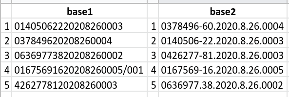

```{r, child="00-preamble.Rmd"}
```

```{r, include = FALSE}
knitr::opts_chunk$set(echo = FALSE)
```


class: middle, center

# `r blue("Integração")`

---

# Unidade amostral

Unidade amostral é o que define as observações de uma base de dados. Por exemplo, uma base pode ter como unidade amostral processos, ou como unidade amostral decisões, já que é possível ter mais de uma decisão por processo.

Cabe à pessoa gestora dos dados decidir como esses dados devem ser disponibilizados para análise.

Usualmente, a unidade amostral precisa de um **número identificador único** para permitir a integração com outras bases de dados.

---

# Join

Join é a tarefa de juntar bases de dados pelas __linhas__ que compartilham __variáveis__ com __valores__ em comum.

Exemplos: 

- Juntar base de municípios com outras bases
- Juntar base de empresas com base da Receita
- Juntar bases internas da empresa

---

# Tipos de join

```{r, fig.cap="Imagem retirada do livro R4DS.", out.width="40%", fig.align="center"}
knitr::include_graphics("https://d33wubrfki0l68.cloudfront.net/9c12ca9e12ed26a7c5d2aa08e36d2ac4fb593f1e/79980/diagrams/join-outer.png")
```

---

# Partial matching

"Mogi-Mirim" pode estar escrito na forma "Mogi Mirim". 

Quando fazemos o join diretamente com os dados assim, os programas são incapazes de reconhecer que estamos trabalhando com a mesma comarca.

Nesse caso, temos duas alternativas:

- Adicionar rotinas de arrumação de dados: caixa alta/baixa, acentos, traços, padronização do número de caracteres, entre outros.

- Utilizar mecanismos de partial matching, como Fuzzy Join (por distância de Levenshtein, Jaccard etc), ou de forma mais sofisticada com Record Linkage

```{r, echo=TRUE, eval=FALSE}
stringdist::stringdist("Mogi-Mirim", "Mogi-Mirim")
stringdist::stringdist("Mogi-Mirim", "Mogi Mirim")
```

    [1] 0    
    [1] 1

---

# Exercício

.pull-left[

Temos duas bases de processos judiciais e queremos juntá-las. 

Uma vem da base interna da empresa e outra vem dos tribunais (dados públicos). Ambas têm como unidade amostral o processo, identificadas pelo número CNJ dos processos.

Ao fazer o join das bases, no entanto, obervamos 0 matchings. O que fazer?

]

.pull-right[

```{r}

```

]